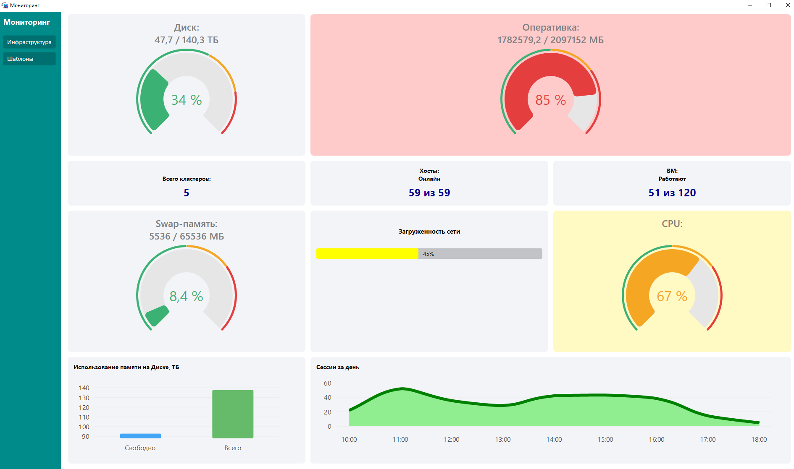
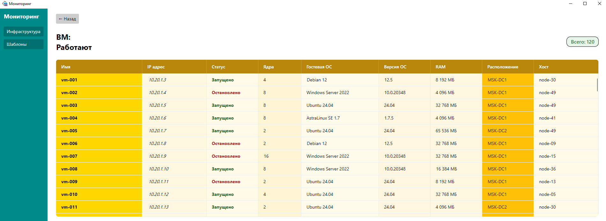
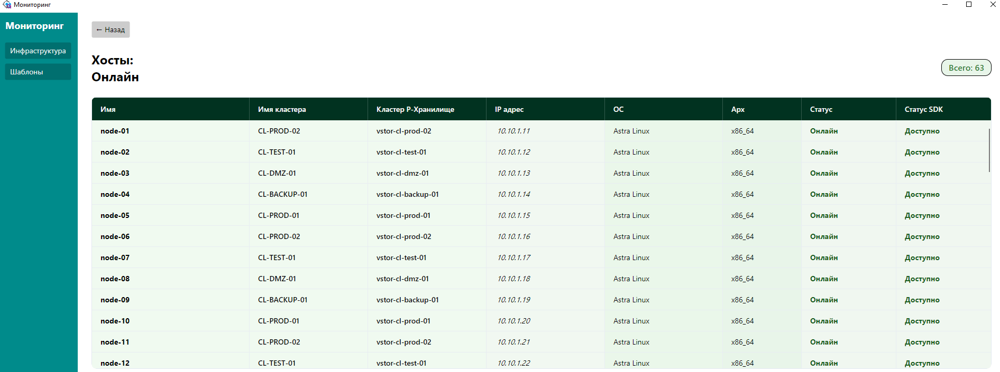
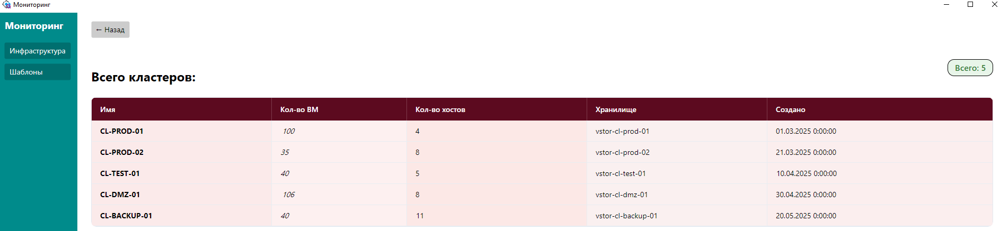
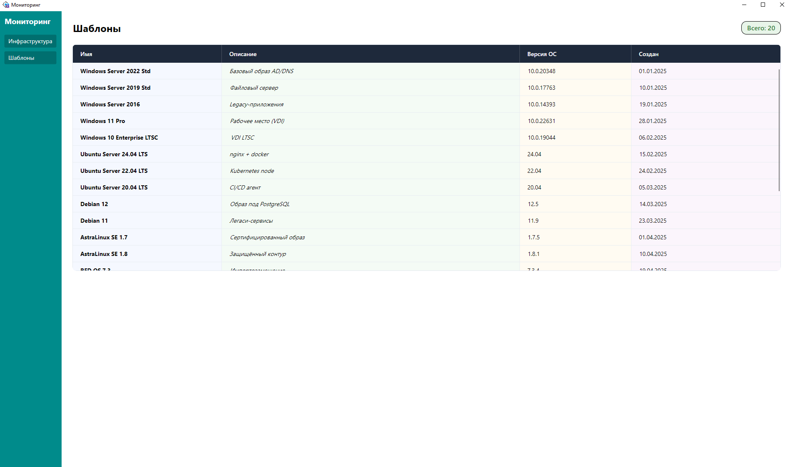
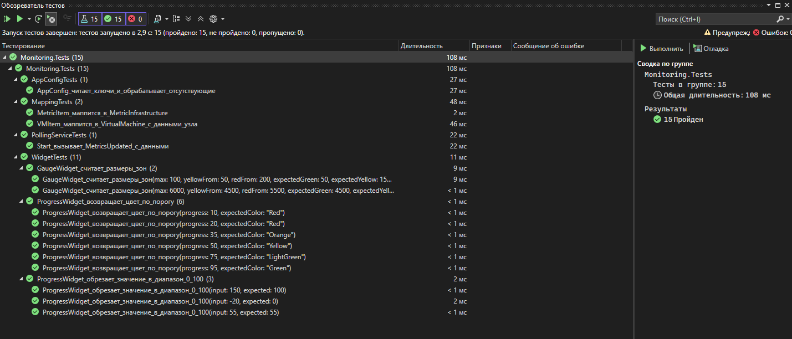

# Мониторинг виртуальной инфраструктуры

Кроссплатформенное десктоп-приложение на базе Microsoft WPF Avalonia C# для мониторинга виртуальной инфраструктуры: метрики нагрузки (CPU, RAM, диск, swap), статистика узлов и виртуальных машин, списки кластеров, хостов, ВМ и шаблонов ОС. Данные подтягиваются с REST API по сессионной авторизации и обновляются в реальном времени.

Проект выполнен во время производственной практики в «Газпром информ» — как внутренний инструмент для развёртывания в закрытом контуре (в том числе на Linux-хостах). Ключевыми требованиями были **кроссплатформенность**, **быстрая и понятная навигация** и **живое обновление данных**.

> **Про API и демо-режим.** Боевой REST API доступен только внутри локальной сети организации. Чтобы приложение можно было запустить, показать и протестировать вне этого контура, в репозитории есть **лёгкий мок-API** (`MockApi`) — он повторяет боевой один-в-один: авторизацию по куке, те же эндпоинты и те же JSON-структуры. Достаточно запустить мок и приложение — данные визуализируются без доступа к реальной инфраструктуре.

---

## Скриншоты

<!-- Картинки лежат в docs/screenshots/. Имена файлов регистрозависимы (важно для GitHub). -->

### Дашборд «Инфраструктура»



### Детализация по двойному клику

**Виртуальные машины**



**Хосты**



**Кластеры**



### Шаблоны ОС



---

## Возможности

- **Дашборд «Инфраструктура»** — набор виджетов с метриками: радиальные gauge (диск/память/CPU с цветовыми зонами «норма/предупреждение/критично»), прогресс-бары, линейные графики.
- **Живое обновление** — фоновый сервис опрашивает API по таймеру и рассылает новые метрики виджетам через событие; графики плавно перерисовываются.
- **Детализация по клику** — двойной клик по виджету открывает подробную таблицу (кластеры / хосты / виртуальные машины) с закреплённой шапкой, сортируемыми по смыслу колонками, цветовой индикацией статусов и всплывающими подсказками.
- **Раздел «Шаблоны»** — таблица шаблонов ОС (имя, описание, версия, дата создания).
- **Навигация в стиле «оболочка + регион»** — постоянное боковое меню слева, сменная рабочая область справа.
- **Гибкая конфигурация** — адреса API, эндпоинты и учётные данные вынесены в `config.json`, код от них не зависит.

---

## Стек и технологии — и почему именно они

| Технология | Роль | Почему выбрана |
|---|---|---|
| **.NET 6 / C#** | платформа и язык | LTS-версия, кроссплатформенный рантайм (не привязан к Windows), строгая типизация, зрелая экосистема |
| **Avalonia UI 11** | UI-фреймворк | В отличие от WPF работает на **Windows / Linux / macOS** из одного кода — ключевое требование задачи (развёртывание на Linux). Рисует интерфейс сам через **SkiaSharp**, а не через нативные контролы ОС, поэтому вид одинаков на всех платформах |
| **Prism (DryIoc) для Avalonia** | MVVM-каркас, DI, навигация | Готовые `BindableBase`, `DelegateCommand`, **внедрение зависимостей** и **регионы** для навигации. Позволил строить приложение из слабосвязанных модулей и легко подменять реализации (боевой API ↔ мок) одной строкой регистрации |
| **LiveChartsCore (SkiaSharpView)** | графики и диаграммы | Кроссплатформенный рендеринг через тот же SkiaSharp, что и Avalonia. Поддерживает линейные графики, столбчатые/круговые диаграммы, радиальные gauge с секциями — всё, что нужно для дашборда, с плавной анимацией при live-обновлении |
| **AutoMapper** | маппинг DTO → доменные модели | Отделяет «сырой» формат ответа API (snake_case, вложенность) от чистых доменных моделей приложения. При изменении формата API правится только слой DTO и маппинг |
| **System.Text.Json** | (де)сериализация | Встроенный, быстрый; атрибуты `JsonPropertyName` точно сопоставляют поля JSON с моделями |
| **HttpClient + CookieContainer** | доступ к API | Сессионная авторизация по куке (аналог `-WebSession` в PowerShell): один логин, дальше сессия переносится автоматически |
| **xUnit** | модульные тесты | Стандарт для .NET; покрыта ключевая логика (виджеты, конфиг, маппинги, поллинг) |
| **ASP.NET Core Minimal API** | мок боевого API | Минимум кода для полноценного HTTP-сервера: авторизация, эндпоинты и JSON под структуры приложения |

### Почему Avalonia, а не WPF

**WPF** — привычный и стандартный выбор для десктопа на .NET, и подход **MVVM + XAML** у них общий, поэтому навыки (привязки, команды, вьюмодели) переносятся между ними напрямую. Ключевое ограничение: **WPF работает только под Windows**. А по задаче требовалось развёртывание в том числе на **Linux**.

Поэтому выбрана **Avalonia**: та же модель разработки (MVVM, XAML, DataBinding, DI), но один и тот же код запускается на **Windows, Linux и macOS**, а интерфейс рендерится через SkiaSharp одинаково на всех платформах. Проще говоря — «WPF, который умеет в Linux».

### Инструменты разработки

- **Visual Studio 2022** — основная IDE: редактор, отладчик, **Test Explorer** для прогона тестов.
- **.NET 6 SDK** — сборка, запуск и тесты (`dotnet build` / `dotnet run` / `dotnet test`).
- **Avalonia for Visual Studio** — расширение с живым превью XAML-разметки.
- **NuGet** — управление зависимостями (Avalonia, Prism, LiveCharts, AutoMapper, xUnit).
- **PowerShell** — ручная проверка REST API на этапе разработки (`Invoke-RestMethod` с сессией по куке).
- **Git** — контроль версий.

---

## Архитектура

Приложение построено по **MVVM** с чётким разделением слоёв и внедрением зависимостей.

```
Views (XAML)  →  ViewModels  →  Services (Infrastructure)  →  REST API
                     │                     │
                  Widgets            AutoMapper
                     │                     │
              Domain models  ← ← ←  DTO models (Models/*)
```

**Ключевые решения:**

- **Разделение DTO и домена.** `Models/*` — модели под формат API (`[JsonPropertyName]`, вложенность). `Monitoring.Sharing/Data` — чистые доменные модели для UI. Между ними — AutoMapper. Формат API изменится — приложение это не заметит.
- **Программирование через интерфейсы + DI.** `IApiService`, `IAppConfig`, `IMetricsPollingService` вынесены в отдельный проект-контракт `Monitoring.Sharing`. Реализации регистрируются в контейнере (`App.axaml.cs`), поэтому боевой `ApiService` заменяется на `FakeApiService`/мок одной строкой — без правок ViewModel.
- **Живое обновление через событие.** `MetricsPollingService` на `PeriodicTimer` опрашивает API и вызывает событие `MetricsUpdated`; виджеты на него подписаны. Обновления доставляются в UI-поток через `Dispatcher`.
- **Виджеты как данные + шаблон.** Дашборд — это коллекция виджетов разных типов; какой контрол их рисует, решает `DataTemplate` по типу. Добавить новый тип виджета = новый класс + шаблон, без правок остального кода.
- **Навигация через регионы Prism.** Оболочка (`MainWindow`) с постоянным меню + сменный `ContentRegion`; переходы — `RequestNavigate`, передача данных на экран деталей — через `NavigationParameters`.

### Структура репозитория

```
Monitoring - приложение ИТОГ/
├─ Monitoring/                       # основное приложение (Avalonia)
│  ├─ Views/                         # XAML-представления (оболочка, дашборд, детали, шаблоны)
│  ├─ ViewModels/                    # вьюмодели (навигация, экраны)
│  ├─ Models/                        # DTO под ответы API (метрики, кластеры, хосты, ВМ, шаблоны)
│  ├─ Models/Widgets/                # виджеты дашборда (gauge, progress, line, bar, info, status)
│  ├─ Infrastructure/ApiService.cs   # доступ к REST API (HttpClient, кука-сессия)
│  ├─ Tools/                         # AppConfig, MetricsPollingService, профили AutoMapper
│  └─ Program.cs / App.axaml.cs      # точка входа и регистрация зависимостей
├─ Monitoring.Sharing/               # контракты и доменные модели (переиспользуемое ядро)
│  ├─ Interfaces/                    # IApiService, IAppConfig, IMetricsPollingService
│  └─ Data/                          # доменные модели (Metric, Cluster, Host, VirtualMachine, ...)
├─ Monitoring.Tests/                 # модульные тесты (xUnit)
├─ MockApi/                          # мок боевого API (ASP.NET Core Minimal API)
└─ config.json                       # конфигурация (адрес API, эндпоинты, учётные данные)
```

---

## Мок-API (демо-режим)

Так как доступа к боевому API вне локальной сети организации нет, для запуска и демонстрации сделан **`MockApi`** — минимальный HTTP-сервер на ASP.NET Core, который ведёт себя как настоящий:

- **Авторизация по куке.** `POST /api/0/auth` проверяет логин/пароль, выдаёт сессионный токен в `Set-Cookie`; защищённые эндпоинты требуют эту куку (иначе `401`).
- **Те же эндпоинты и JSON-структуры**, что у боевого API: метрики инфраструктуры, кластеры, хосты, виртуальные машины, шаблоны ОС.
- **Согласованные данные.** Статистика (кол-во кластеров, онлайн-узлов, ВМ по статусам) вычисляется из тех же списков, что отдаются в таблицы, — цифры на дашборде и в деталях сходятся.

Благодаря разделению через интерфейсы приложение работает с мок-API **без единой правки кода** — меняется только `config.json`.

---

## Конфигурация

Все внешние параметры — в `config.json` (копируется в каталог сборки):

```json
{
  "ApiBaseUrl": "http://localhost:5005/",
  "LoginUrl": "/api/0/auth",
  "Login": "admin",
  "Password": "admin",
  "EndPointMetrics": "/api/0/monitoring/infrastructure",
  "EndPointTemplates": "/api/0/template",
  "EndPointClusters": "/api/0/cluster",
  "EndPointHosts": "/api/0/node",
  "EndPointVM": "/api/0/vm"
}
```

Для боевого контура достаточно подставить реальный `ApiBaseUrl` и учётные данные.

---

## Запуск

Требуется **.NET 6 SDK**.

**1. Поднять мок-API** (демо-режим):

```bash
cd MockApi
dotnet run
# слушает http://localhost:5005, логин admin / admin
```

**2. Запустить приложение:**

```bash
cd Monitoring
dotnet run
```

Приложение авторизуется по куке, начнёт опрос метрик и покажет дашборд.

### Развёртывание на Linux

Благодаря Avalonia приложение собирается под Linux из того же кода:

```bash
dotnet publish Monitoring -c Release -r linux-x64
```

---

## Тесты

Модульные тесты (xUnit) покрывают ключевую логику:

```bash
dotnet test
```

Покрыто: обрезка и цветовая индикация значений виджетов, расчёт цветовых зон gauge, чтение конфигурации, маппинги DTO → домен (включая кастомные правила), запуск и оповещение сервиса поллинга.



---

## Итог

Приложение решает поставленную задачу — кроссплатформенный мониторинг с быстрой навигацией и живыми данными — на современном стеке .NET/Avalonia, с чистой слоистой архитектурой, внедрением зависимостей, покрытием тестами и возможностью демонстрации без доступа к боевому API за счёт мок-сервера.
