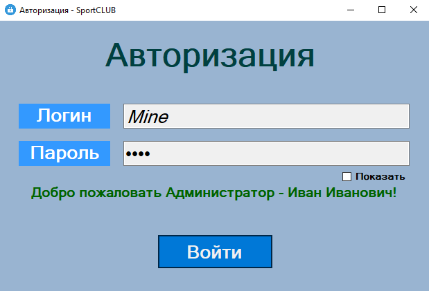

# SportCLUB — настольное приложение для управления спортивным клубом

Настольное приложение на **C# / Windows Forms** с базой данных **Microsoft SQL Server**. Автоматизирует работу спортивного клуба: учёт игроков, тренеров, соревнований и травм, а также разграничение доступа по трём ролям — администратор, тренер и игрок. Данные хранятся в SQL Server, доступ к ним организован через ADO.NET.

Проект выполнен как учебный и демонстрирует навыки: проектирование оконного интерфейса на WinForms, работа с реляционной базой данных и SQL-запросами (в том числе с объединением таблиц), реализация ролевой авторизации и применение шаблона проектирования.

---

## Скриншоты

<!-- Скриншоты положить в папку docs/screenshots/ и вставить ссылки ниже. -->

### Форма входа



### Панель администратора


### Карточка игрока / тренера


### Карточка добавления игрока / тренера


### Карточка добавления соревнования (кандидаты сами подбираются в хранимой процедуре в БД)


---

## Архитектура

Приложение построено на классической модели WinForms: каждая экранная форма (`*.cs` + `*.Designer.cs`) отвечает за свой участок работы, а бизнес-сущности вынесены в отдельные классы.

**Доступ к данным.** Класс `DataBase` хранит подключение к SQL Server и открывает/закрывает соединение. Формы обращаются к базе через два вспомогательных метода: `GetDataFromDB(query)` — возвращает результат выборки в виде `DataTable` (через `SqlDataAdapter`), и `EditDataFromDB(query)` — выполняет команды на изменение данных (`INSERT`/`UPDATE`/`DELETE` через `ExecuteNonQuery`).

**Сущности.** Классы `Players`, `Coaches`, `Admins`, `Competitions` описывают объекты предметной области. Для ролей `Players`, `Coaches` и `Admins` реализован общий интерфейс `Access`.

**Авторизация — «Цепочка обязанностей».** Интерфейс `Access` задаёт методы `Log_in` и `LowerAccess`. При входе выстраивается цепочка обработчиков: администратор → тренер → игрок. Каждый обработчик ищет пользователя в своём списке; если не находит — передаёт запрос следующему звену. Так роль определяется без длинных ветвлений `if/else`.

**Безопасность паролей.** Пароли не хранятся в открытом виде: при чтении из базы они расшифровываются методами `Encrypt`/`Decrypt` на основе AES.

### Структура репозитория

```
SportCLUB_WinForms_MS-SQL-SERVER/
├─ SportCLUB/
│  ├─ SportCLUB.sln                  # файл решения Visual Studio
│  └─ SportCLUB/
│     ├─ Program.cs                  # точка входа, запуск формы входа
│     ├─ Form1.cs                    # форма входа + вход по «Цепочке обязанностей»
│     ├─ DataBase.cs                 # подключение к SQL Server (ADO.NET)
│     ├─ Access.cs                   # интерфейс ролей (Log_in, LowerAccess)
│     │
│     ├─ Players.cs / Coaches.cs / Admins.cs   # роли-обработчики входа
│     ├─ Competitions.cs             # сущность «Соревнование»
│     │
│     ├─ AdminsForm.cs               # рабочее окно администратора
│     ├─ CoachForm.cs                # рабочее окно тренера
│     ├─ PlayerForm.cs               # рабочее окно игрока
│     │
│     ├─ AddPlayer.cs / SetPlayer.cs / ShowInfoPlayer.cs   # операции с игроками
│     ├─ ChangeInfoForUser.cs
│     ├─ AddCoach.cs / ChangeCoach.cs / ChangeInfoForCoach.cs   # операции с тренерами
│     ├─ AddCompetition.cs / ChangeInfoComp.cs   # операции с соревнованиями
│     ├─ AddInjures.cs               # учёт травм
│     │
│     ├─ *.Designer.cs / *.resx      # разметка форм и ресурсы (генерируются дизайнером)
│     ├─ App.config                  # конфигурация приложения
│     └─ Properties/                 # AssemblyInfo, Resources, Settings
│
└─ База данных/
   └─ SportCLUB.bacpac               # экспорт базы данных для развёртывания
```

---

## Стек и технологии

| Технология | Роль в проекте |
|---|---|
| **C# / .NET Framework 4.7.2** | язык и платформа приложения |
| **Windows Forms** | оконный пользовательский интерфейс (формы, DataGridView, элементы управления) |
| **ADO.NET** (`System.Data.SqlClient`) | доступ к базе данных: подключение, запросы, чтение и изменение данных |
| **Microsoft SQL Server** | реляционная СУБД для хранения данных клуба |
| **AES** (`System.Security.Cryptography`) | шифрование паролей пользователей |
| **Chain of Responsibility** | шаблон проектирования для определения роли при входе |

---

## Возможности

**Вход и роли.** Единая форма входа для трёх ролей — администратор, тренер, игрок. Пароли хранятся в базе в зашифрованном виде (AES) и расшифровываются при загрузке. Роль пользователя определяется автоматически по шаблону «Цепочка обязанностей» (поведенческий паттерн проектирования "Chain Responsibillity"): запрос на вход последовательно проверяется обработчиками администратора, тренера и игрока, пока не найдётся совпадение. После успешного входа открывается рабочее окно, соответствующее роли.

**Администратор** — полное управление данными клуба: добавление и изменение игроков, тренеров и соревнований, просмотр таблиц в наглядных таблицах (DataGridView).

**Тренер** — просмотр своих игроков и сведений о них, редактирование собственных данных, учёт травм своих игроков.

**Игрок** — просмотр личной информации и соревнований, изменение контактных данных и единственная возможность поменять тренера.

**Работа с данными.** Приложение выполняет SQL-запросы к базе: выборки с человекочитаемыми заголовками столбцов, объединение связанных таблиц (JOIN), добавление и обновление записей. Отдельные окна отвечают за каждую операцию (добавление игрока, изменение тренера, добавление соревнования и т. д.).

---

## База данных

Данные хранятся в SQL Server (база `SportClub`). В комплекте есть файл **`База данных/SportCLUB.bacpac`** — это экспорт базы, из которого её можно развернуть у себя. Основные таблицы: администраторы, тренеры, игроки, контакты и адреса, соревнования, разряды (уровни мастерства) и травмы; между таблицами настроены связи, которые используются в запросах через `JOIN`.

---

## Запуск

**Что понадобится:**

- Visual Studio 2019/2022 с поддержкой .NET Framework 4.7.2;
- Microsoft SQL Server (например, SQL Server Express) и SQL Server Management Studio.

**Шаги:**

1. Развернуть базу данных из файла `База данных/SportCLUB.bacpac` (в SSMS: *Databases → Import Data-tier Application*).
2. Открыть решение `SportCLUB/SportCLUB.sln` в Visual Studio.
3. В файле `DataBase.cs` указать свою строку подключения (имя сервера и имя базы данных):

   ```csharp
   SqlConnection con = new SqlConnection(
       @"Data Source=ИМЯ_СЕРВЕРА;Initial Catalog=ИМЯ_БАЗЫ_ДАННЫХ;Integrated Security=True");
   ```

4. Собрать и запустить проект (F5). Откроется форма входа; после авторизации — окно, соответствующее роли пользователя.

---

## Возможные улучшения

Проект учебный, и в нём есть что развивать дальше — это отдельно проработанные направления роста:

- перевести SQL-запросы на **параметры** (`SqlParameter`) для защиты от SQL-инъекций;
- перейти на Entity Framework, чтобы автоматически генерировались SQL-запросы, а не вручную;
- вынести строку подключения из кода в `App.config`;
- заменить обратимое шифрование паролей на **необратимое хеширование** (например, BCrypt) с солью;
- вынести доступ к данным в отдельный слой (репозитории), чтобы формы не работали с SQL напрямую.

---

*Автор: Иван Широковских · GitHub: [https://github.com/QWQ916/Portfolio]*
