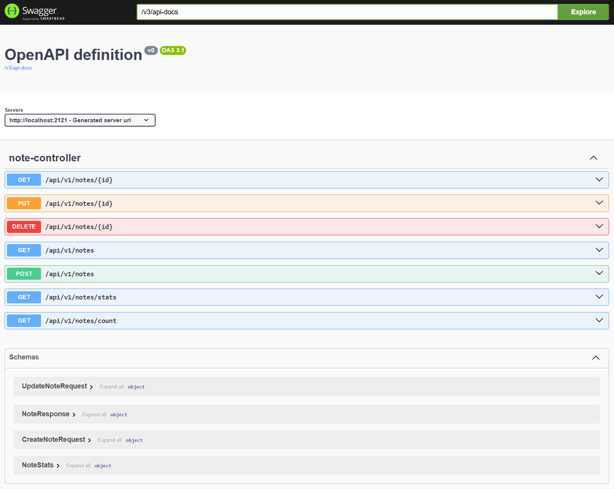
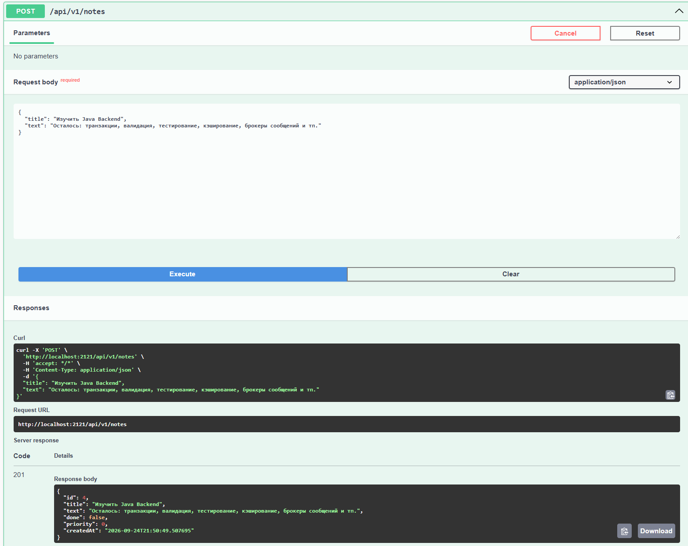
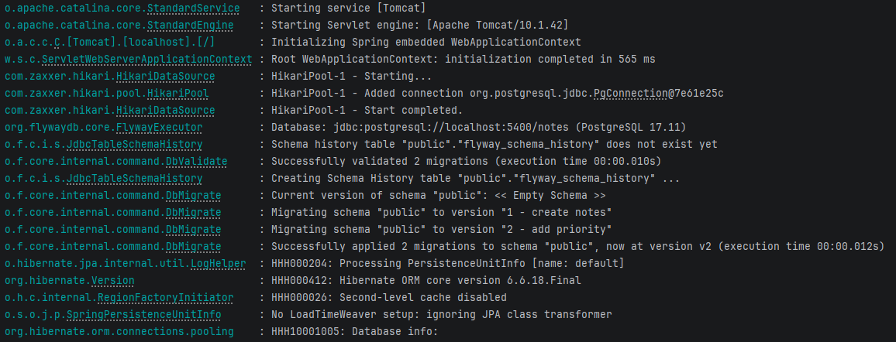

# Notes API

REST API для заметок на Spring Boot. Учебный проект, написанный при изучении Java-бэкенда.

---

## О проекте

Пишу на C#, сейчас перехожу на Java. Этот проект — способ разобраться со Spring Boot
не по туториалам, а собрав работающее приложение с нуля: от первого контроллера
до базы в контейнере.

Цель была не «сделать заметки», а пройти полный путь бэкенд-разработчика:
слои приложения, внедрение зависимостей, ORM, версионирование схемы БД,
разделение внутренней модели и внешнего контракта.

Проект **не закончен** — в конце есть честный список того, чего в нём нет и почему.



---

## Стек

| | |
|---|---|
| Язык | Java 21 |
| Фреймворк | Spring Boot 3.5.3 |
| БД | PostgreSQL 17 (в Docker) |
| Доступ к данным | Spring Data JPA / Hibernate |
| Миграции | Flyway |
| Документация | springdoc-openapi (Swagger UI) |
| Сборка | Maven |

---

## Быстрый старт

Нужны установленные **JDK 21** и **Docker Desktop**.

```bash
# 1. Поднять базу
docker compose up -d

# 2. Запустить приложение
./mvnw spring-boot:run        # Linux / macOS
.\mvnw.cmd spring-boot:run    # Windows
```

Приложение стартует на порту **2121**, база слушает на **5400**.

При первом запуске Flyway сам создаст схему — руками ничего накатывать не нужно.

**Swagger UI:** http://localhost:2121/swagger-ui.html
**OpenAPI JSON:** http://localhost:2121/v3/api-docs

Остановить базу: `docker compose down` (данные сохранятся в томе)
Удалить вместе с данными: `docker compose down -v`

---

## API

Базовый путь: `/api/v1/notes`

| Метод | Путь | Описание | Коды |
|---|---|---|---|
| `GET` | `/api/v1/notes` | Список с фильтрами | 200 |
| `GET` | `/api/v1/notes/{id}` | Одна заметка | 200, 404 |
| `GET` | `/api/v1/notes/count` | Количество заметок | 200 |
| `GET` | `/api/v1/notes/stats` | Всего / выполнено | 200 |
| `POST` | `/api/v1/notes` | Создать | 201 |
| `PUT` | `/api/v1/notes/{id}` | Заменить целиком | 200, 404 |
| `DELETE` | `/api/v1/notes/{id}` | Удалить | 204, 404 |

### Параметры списка

| Параметр | Тип | По умолчанию | Описание |
|---|---|---|---|
| `str` | string | — | Поиск по заголовку, без учёта регистра |
| `done` | boolean | — | Фильтр по статусу. Не указан — обе категории |
| `sort` | string | `date` | `date` или `title` |
| `limit` | long | `15` | Сколько вернуть |

### Примеры

```bash
# Создать
curl -X POST http://localhost:2121/api/v1/notes \
  -H "Content-Type: application/json" \
  -d '{"title":"Купить молоко","text":"И хлеб"}'

# Найти невыполненные, содержащие «молоко», по названию
curl "http://localhost:2121/api/v1/notes?str=молоко&done=false&sort=title"

# Заменить целиком
curl -X PUT http://localhost:2121/api/v1/notes/1 \
  -H "Content-Type: application/json" \
  -d '{"title":"Купить молоко","text":"И хлеб","done":true}'

# Удалить
curl -X DELETE http://localhost:2121/api/v1/notes/1
```

Ответ на создание:

```json
{
  "id": 1,
  "title": "Купить молоко",
  "text": "И хлеб",
  "done": false,
  "priority": 0,
  "createdAt": "2026-09-24T18:30:00.123"
}
```

То же самое из Swagger UI — `id` и `createdAt` проставляет сервер,
клиент их не присылает:



---

## Архитектура

```
ru.my.notes.noteseducationapi
├── note
│   ├── Note.java              @Entity — модель для БД
│   ├── NoteService.java       @Service — бизнес-логика
│   └── NoteController.java    @RestController — HTTP
├── dto
│   ├── CreateNoteRequest      что принимаем при создании
│   ├── UpdateNoteRequest      что принимаем при изменении
│   ├── NoteResponse           что отдаём наружу
│   └── NoteStats              статистика
└── repository
    └── NoteRepository.java    интерфейс Spring Data JPA
```

Три слоя, зависимости строго в одну сторону:

```
Контроллер  →  Сервис  →  Репозиторий  →  PostgreSQL
   (HTTP)      (логика)    (данные)
```

- Контроллер не знает про базу, сервис не знает про HTTP.
- Все зависимости внедряются через конструктор, поля `private final`.
- Наружу уходят только DTO, сущность `Note` за пределы сервиса не выходит.

### Схема БД

Управляется миграциями Flyway в `src/main/resources/db/migration`:

| Файл | Что делает |
|---|---|
| `V1__create_notes.sql` | Таблица `notes` + индекс по заголовку |
| `V2__add_priority.sql` | Колонка `priority` |

Миграции накатываются автоматически при старте, до инициализации Hibernate.
Применённые версии Flyway хранит в служебной таблице `flyway_schema_history`:



---

## Технические решения

Решения, которые принимал осознанно, — и почему.

**Схема БД через миграции, а не `ddl-auto: update`.**
Стоит `ddl-auto: validate`: Hibernate только сверяет сущности с таблицами
и падает при расхождении, а создаёт схему Flyway. `update` не умеет удалять
и переименовывать колонки и не даёт воспроизводимого результата
на чужой машине.

**DTO отдельно от сущности.**
Контроллер не возвращает `Note`. Иначе любое новое поле в сущности
автоматически уезжало бы в публичный ответ, а структура таблицы
становилась бы контрактом API. Три DTO вместо одного универсального —
чтобы по типу было видно, что именно принимается и отдаётся.

**`open-in-view: false`.**
По умолчанию Spring держит сессию Hibernate открытой до конца обработки
запроса — это маскирует ленивую загрузку в слое представления
и удерживает соединение из пула дольше, чем нужно.

**Внедрение через конструктор, а не `@Autowired` на полях.**
Поля становятся `final`, объект нельзя создать в недособранном состоянии,
и класс можно инстанцировать в тестах без поднятия контекста Spring.

**Примитивы для `NOT NULL`, обёртки для nullable.**
`Long id` — у несохранённой заметки id ещё нет. `boolean done`,
`int priority` — в базе `NOT NULL`, значит null невозможен и на стороне Java.

**`Optional` вместо `null` из сервиса.**
Сигнатура метода сама сообщает, что результата может не быть, и контроллер
превращает пустой `Optional` в 404 через `ResponseEntity.of()`.

---

## Чего в проекте нет

Пишу честно — это учебный проект в процессе, и список пробелов
мне известен.

**Валидация входных данных.**
Сейчас можно создать заметку с пустым заголовком, а `null` в обязательном
поле приведёт к 500 вместо 400. Нужен `spring-boot-starter-validation`
и аннотации `@Valid` / `@NotBlank` на DTO.

**Обработка ошибок.**
Нет `@RestControllerAdvice` с единым форматом ответа. Непредвиденные
исключения отдают стандартный ответ Spring вместо осмысленного сообщения
с кодом и описанием.

**Тесты.**
Есть только сгенерированный `contextLoads()`. Планирую модульные тесты
сервиса на Mockito, `@WebMvcTest` для контроллера и `@DataJpaTest`
с Testcontainers для репозитория.

**Фильтрация выполняется в памяти.**
`getAndFilterNotes` загружает все заметки через `findAll()` и фильтрует
их Stream API. На учебном объёме это незаметно, но правильное решение —
`Specification` и `Pageable`, чтобы отбор и сортировка выполнялись в СУБД.

**Транзакции.**
`@Transactional` не расставлен. Пока все операции атомарны сами по себе
(одно обращение к репозиторию), но при усложнении логики это станет
проблемой.

**Пароль БД в `application.yml` открытым текстом.**
Допустимо для локального учебного проекта, но в реальном нужны
переменные окружения или секреты.

**Нет `PATCH` для отдельных полей.**
Чтобы переключить `done`, приходится отправлять весь объект через `PUT`.
